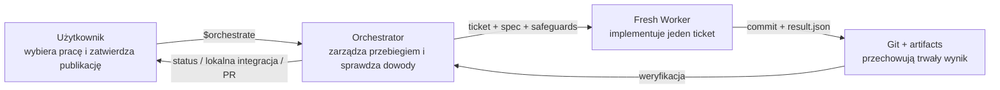
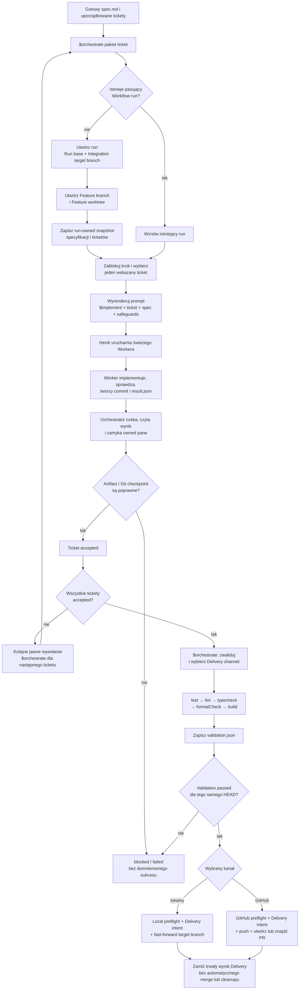
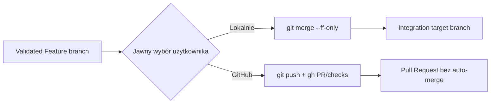

# Coding Orchestrator — aktualny flow V1

> [!NOTE]
> Ten dokument opisuje zaimplementowany przepływ V1 po zakończeniu Phase 7 z roadmapy [Phase 5 onward](coding-orchestrator-roadmap-phase-5-onward.md). `scripts/flow` jest wewnętrznym, deterministycznym helperem. Użytkownik komunikuje się ze skillem `$orchestrate` i nie musi pamiętać jego komend, Run ID ani ścieżek worktree.

## Najkrótszy model mentalny



| Element         | Odpowiedzialność                                                                                               |
| --------------- | -------------------------------------------------------------------------------------------------------------- |
| Użytkownik      | Przygotowuje spec i tickety, wskazuje kolejny ticket, zleca końcową walidację i wybiera kanał dostawy.         |
| Orchestrator    | Tworzy lub wznawia run, uruchamia Workerów, sprawdza commity, wykonuje końcową walidację i bezpieczny handoff. |
| Worker          | W świeżym kontekście implementuje dokładnie jeden ticket w Feature worktree.                                   |
| `$implement`    | Definiuje metodologię implementacji używaną przez Workera.                                                     |
| Herdr           | Uruchamia proces Workera, dostarcza prompt i pozwala czekać na jego zakończenie.                               |
| Git i artifacts | Stanowią trwałe dowody wykonanej pracy; rozmowa agenta nie jest źródłem prawdy.                                |

## Pełny przepływ



## 0. Jednorazowe przygotowanie Target repository

Zanim rozpocznie się pierwszy Workflow run:

1. Installed skill `orchestrate` jest zbudowany i zainstalowany.
2. Target repository jest repozytorium Git z początkowym commitem.
3. Repozytorium ma konfigurację Orchestratora albo pozwala utworzyć jej domyślną wersję przy pierwszym wywołaniu.
4. Konfiguracja wskazuje Codex Agent profile Workera, downstream skill `implement`, timeout i końcowe komendy walidacyjne; domyślne komendy trzeba dopasować, jeśli Target repository nie używa pnpm.
5. Specyfikacja i tickety są przygotowane jako lokalny Workflow package.

Przykładowe wejście:

```text
feature-calculator/
├── spec.md
└── issues/
    ├── 01-add-multiply.md
    └── 02-add-safe-divide.md
```

- `spec.md` opisuje cel i wspólne ograniczenia całej funkcji.
- Jeden ticket jest jedynym zakresem implementacji pojedynczego Workera.
- Kolejność nazw plików określa kolejność Ticket queue.
- Cały Workflow package musi znajdować się wewnątrz Target repository.

## 1. Użytkownik zleca jeden ticket

```text
$orchestrate feature-calculator 01-add-multiply
```

Skill tłumaczy intencję użytkownika na wewnętrzne operacje helpera. Użytkownik nie wywołuje `scripts/flow` bezpośrednio.

## 2. Orchestrator tworzy albo wznawia Workflow run

Przy pierwszym tickecie Orchestrator:

1. Sprawdza, czy Workflow package zawiera poprawny `spec.md` i uporządkowane tickety.
2. Zapamiętuje bieżący lokalny branch jako Integration target branch.
3. Zapamiętuje jego aktualny commit jako niezmienny Run base.
4. Tworzy Orchestrator-owned Feature branch od Run base.
5. Tworzy Feature worktree dla tego brancha.
6. Kopiuje wejścia pakietu do run-owned input snapshot.
7. Zapisuje State snapshot i Operational history w Target repository.

Przy kolejnym wywołaniu Orchestrator wznawia jedyny pasujący run. Jeżeli wybór jest niejednoznaczny, zatrzymuje się i prosi użytkownika o wskazanie zamiast zgadywać.

```text
Primary checkout                   Feature worktree
Integration target branch         Orchestrator Feature branch
pozostaje nietknięty               tutaj pracują Workery
        │                                   │
        └──────── wspólny Run base ─────────┘
```

## 3. Orchestrator przygotowuje wykonanie Workera

Orchestrator blokuje bieżący Workflow step, aby nie uruchomić tego samego ticketu równolegle, a następnie przygotowuje logiczne wykonanie Workera:

```text
downstream skill: implement
ticket:            jeden Ticket input snapshot
specification:     read-only Specification input snapshot
worktree:          Feature worktree
result:            wydzielona ścieżka result.json
safeguards:        kanoniczna polityka bezpieczeństwa Workera
```

Agent renderer potrafi zmienić logiczne `implement` na składnię danego agenta:

| Agent       | Wyrenderowane wywołanie |
| ----------- | ----------------------- |
| Codex       | `$implement <ticket>`   |
| Claude Code | `/implement <ticket>`   |
| Pi          | `/skill:implement <ticket>` |

Prompt zawiera tylko przydział pracy, kontekst i Orchestration contract. Nie powiela metodologii należącej do `$implement`.

Agent profile selection lives in the Target repository's `.orchestrator/config.yaml`. The profile can provide only the small set of per-run overrides that the adapter needs; agent-native configuration remains the default:

```yaml
agents:
  pi-openai:
    kind: pi
    provider: openai
    model: gpt-5.6-luna

roles:
  worker:
    agent: pi-openai
    skill: implement
```

When `provider` or `model` is absent, Pi or Claude Code uses its own native configuration. The Orchestrator does not install or synchronize downstream skills between agent-specific skill directories.

> [!IMPORTANT]
> Live Worker V1 obsługuje obecnie wyłącznie profil Codex. Renderowanie składni Claude Code i Pi jest przygotowane i testowane, ale adapter uruchamiający te agent profiles nie został jeszcze zaimplementowany.

## 4. Herdr uruchamia świeżego Workera

1. Herdr tworzy nowe owned pane.
2. Uruchamia świeży Agent profile z `cwd` ustawionym na Feature worktree.
3. Dostarcza już wyrenderowany prompt bez interpretowania jego semantyki.
4. Orchestrator zachowuje ten sam foreground process i czeka na zakończenie.

Każdy ticket otrzymuje świeżego Workera i świeży kontekst. Kolejny Worker widzi wcześniejsze zaakceptowane commity, ponieważ wszystkie tickety jednego runu pracują sekwencyjnie na tej samej Feature branch.

## 5. Worker implementuje dokładnie jeden ticket

Worker:

1. Czyta ticket jako zakres i specyfikację jako szerszy kontekst.
2. Stosuje downstream skill `$implement` (w obecnym live V1: Codex).
3. Zmienia pliki wyłącznie w przypisanym Feature worktree.
4. Uruchamia focused checks odpowiednie dla ticketu.
5. Tworzy co najmniej jeden nowy commit implementacyjny i wskazuje końcowy commit w wyniku.
6. Naprawia oczywiste findings w zakresie ticketu; jeżeli Standards lub Spec finding wymaga decyzji albo rozszerzenia zakresu, publikuje `completed` z `review.status = attention` i najmniejszą wymaganą decyzją.
7. Publikuje strukturalny `result.json` jako `completed`, `blocked` albo `failed`.
8. Kończy pracę.

> [!IMPORTANT]
> Worker nie może modyfikować primary checkout, pushować, tworzyć lub mergować PR, integrować branchy, usuwać worktrees ani niszczyć istniejącej lub niezintegrowanej pracy. Gdy nie może bezpiecznie kontynuować, zwraca `blocked` lub `failed` zamiast zgadywać.

## 6. Orchestrator niezależnie weryfikuje wynik

Zakończenie procesu Workera nie oznacza jeszcze sukcesu ticketu.

Orchestrator:

1. Odczytuje stan procesu i `result.json`.
2. Zamyka wyłącznie należące do tego wykonania pane.
3. Sprawdza schemat wyniku i tożsamość ticketu.
4. Potwierdza, że wskazany commit istnieje i jest osiągalny.
5. Potwierdza właściwy Feature branch i HEAD.
6. Potwierdza wymaganą czystość Feature worktree.
7. Przy czystym review dopiero wtedy zapisuje Git checkpoint i oznacza ticket jako `accepted`.

| Wynik                                  | Zachowanie Orchestratora                                                                        |
| -------------------------------------- | ----------------------------------------------------------------------------------------------- |
| Poprawny commit i artifact             | Ticket staje się `accepted`.                                                                    |
| Poprawny kandydat z `review.attention` | Candidate commit zostaje zachowany, run przechodzi do `blocked`, a ticket nie jest akceptowany. |
| Jawny blocker                          | Run staje się `blocked`; praca i diagnostyka zostają zachowane.                                 |
| Błąd techniczny                        | Próba Workera raportuje `failed`, a run zostaje zablokowany bez checkpointu.                    |
| Niejednoznaczny stan lub side effect   | Fail-closed; użytkownik otrzymuje najmniejszą potrzebną akcję naprawczą.                        |

Przy technicznym błędzie CLI podaje ticket, nieudaną operację, opcjonalny exit code, krótki fragment `stderr` oraz ścieżkę do `execution.json`. Pełne strumienie nie są wypisywane; ograniczona diagnostyka pozostaje w tym rekordzie. Taki błąd nie jest Review attention i nie uruchamia automatycznego retry.

## 7. Użytkownik uruchamia kolejne tickety

Dla następnego ticketu:

```text
$orchestrate feature-calculator 02-add-safe-divide
```

Orchestrator wznawia ten sam run i Feature worktree, ale tworzy nowego Workera. Każde wywołanie wykonuje najwyżej jeden ticket i zwraca kontrolę użytkownikowi.

Powtarzane wywołanie zaakceptowanego ticketu jest bezpiecznym no-op. Review attention pozostawia run z `phase = blocked`, zapisuje `candidateCommit`, findingi i referencję do Worker attempt w `state.json` oraz event `worker.review.attention` w historii; ponowienie raportuje ten sam stan bez uruchamiania kolejnego Workera. Ticket `blocked` może zostać jawnie wznowiony po usunięciu zewnętrznej przyczyny blokady; Orchestrator najpierw reconciliuje trwałe dowody, aby nie zduplikować pracy. Zmiana treści specyfikacji lub ticketu wymaga nowego Workflow package i jawnie nowego runu — istniejący run nadal używa własnego input snapshot.

## 8. Użytkownik zleca walidację i wybiera kanał dostawy

Po zaakceptowaniu wszystkich ticketów użytkownik wydaje jedno polecenie na poziomie intencji:

```text
$orchestrate wszystkie tickety w pakiecie feature-calculator są zakończone — wykonaj walidację i zintegruj wynik lokalnie
```

Orchestrator sam:

1. Znajduje właściwy zakończony implementacyjnie run w bieżącym Target repository.
2. Odmawia działania, jeżeli run jest niejednoznaczny, niekompletny albo Feature worktree nie wskazuje ostatniego zaakceptowanego checkpointu.
3. Uruchamia wewnętrzny deterministic Validation step.
4. Po sukcesie przechodzi do jawnie wybranego handoffu: lokalnej integracji albo GitHub Pull Request.

Użytkownik nie podaje Run ID, wewnętrznej komendy helpera ani ścieżki Feature worktree.

## 9. Deterministic Validation step

Bez uruchamiania kolejnego agenta Orchestrator wykonuje w Feature worktree:

```text
test → lint → typecheck → formatCheck → build
```

Pełny pipeline uruchamia się raz, po zaakceptowaniu kompletnej Ticket queue. Nie jest powtarzany po każdym tickecie.

Każdy wynik zawiera nazwę, dokładną komendę, status, exit code, czas i ograniczone diagnostyki. Orchestrator publikuje atomowo jeden run-owned `validation.json`, po czym ponownie sprawdza:

- czy Feature HEAD się nie zmienił;
- czy Feature worktree pozostał czysty;
- czy wynik dotyczy aktualnego ostatniego checkpointu.

Jeżeli dowolna kontrola zawiedzie, przekroczy timeout albo zmieni Git state, walidacja ma status `failed` i publikacja jest zatrzymana.

Wybrany kanał jest trwały dla runu. Po zapisaniu Delivery intent nie można zmienić lokalnej integracji na PR ani PR na lokalną integrację.

## 10A. GitHub Pull Request handoff

Po przejściu walidacji i po jawnym poleceniu użytkownika Orchestrator:

1. Wykonuje read-only preflight dla `origin`, oficjalnego `gh` i jego uwierzytelnienia.
2. Zapisuje trwały GitHub Delivery intent bezpośrednio przed pierwszą zewnętrzną mutacją.
3. Pushuje istniejącą lokalną Feature branch zwykłym `git push`, bez force.
4. Używa oficjalnego `gh` do znalezienia albo utworzenia jednego Pull Requestu względem zapisanego Integration target branch.
5. Odczytuje GitHub checks dokładnie raz i zapisuje je jako `passed`, `failed`, `pending` albo `unavailable`.
6. Zapisuje Delivery jako `completed` i zwraca link do PR oraz obserwację checks. Ponowienie wykorzystuje trwały stan, remote i ten sam PR zamiast je duplikować.

> [!WARNING]
> V1 nigdy automatycznie nie merguje Pull Requestu. Worker również nigdy nie wykonuje operacji GitHub.

## 10B. Lokalna integracja

Jako alternatywę dla PR użytkownik może jawnie wybrać lokalny handoff. Po read-only preflight Orchestrator zapisuje lokalny Delivery intent, wykonuje wyłącznie bezpieczny fast-forward zwalidowanej Feature branch do zapamiętanego Integration target branch i zapisuje zintegrowany commit jako `completed`.

Integracja jest odrzucana bez mutacji, gdy primary checkout jest brudny, ma inny branch, nie wskazuje już zapisanego Run base, branche się rozeszły albo zwalidowany HEAD nie jest już aktualny. Orchestrator nie tworzy merge commita, nie resetuje pracy i nie rozwiązuje konfliktów automatycznie. Po sukcesie ponowienie zwraca ten sam Delivery result bez kolejnej walidacji lub mutacji.



## Co użytkownik musi pamiętać

Tylko dwa rodzaje intencji:

```text
# Wykonaj jeden ticket
$orchestrate <pakiet> <ticket>

# Po wszystkich ticketach — wybierz jeden kanał
$orchestrate wszystkie tickety w pakiecie <pakiet> są zakończone — wykonaj walidację i zintegruj wynik lokalnie

# albo
$orchestrate wszystkie tickety w pakiecie <pakiet> są zakończone — wykonaj walidację i przygotuj PR
```

Można również zlecić samą walidację pakietu, ale pełny wynik V1 wymaga trzech rzeczy: wszystkich ticketów `accepted`, walidacji `passed` dla dokładnego Feature HEAD oraz Delivery `completed` przez jeden wybrany kanał.

Wewnętrzne komendy `flow`, Run ID, nazwy Feature branch, ścieżki worktree, pliki stanu i artefakty są odpowiedzialnością Orchestratora.
