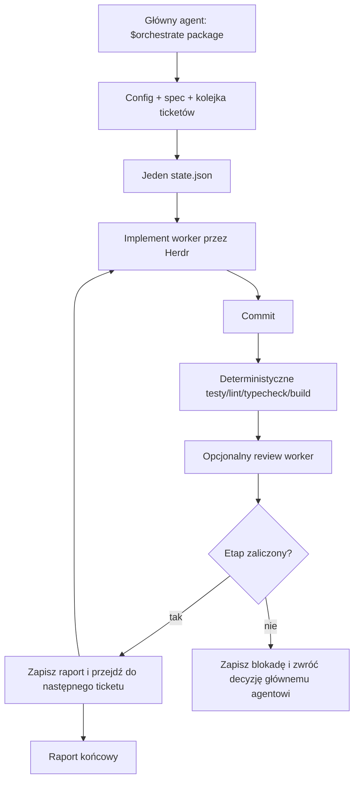

# Uproszczenie Coding Orchestratora

> Status: propozycja docelowego kształtu
>
> Cel: zachować systematyczny workflow nad Herdr, ale ukryć jego mechanikę za małym interfejsem dla głównego agenta.

## 1. Właściwy problem

Coding Orchestrator nie miał zastąpić workflow implementacji. Miał usystematyzować istniejący sposób pracy głównego agenta z Herdr:

1. odczytać zaakceptowany spec i tickety;
2. uruchomić świeżego workera dla pierwszego ticketu;
3. poczekać na implementację i commit;
4. uruchomić deterministyczne testy, lint, typecheck i build;
5. opcjonalnie uruchomić reviewera;
6. zapisać rezultat w jednym miejscu;
7. automatycznie przejść do kolejnego ticketu;
8. zatrzymać się tylko wtedy, gdy potrzebna jest decyzja człowieka.

Przykładowy skill `herdr-workflow` już pokazuje właściwy model. Trzy agenty działają jako prosty relay:

```text
Codex implementuje → Pi reviewuje → reporter tworzy raport
```

Orchestrator powinien ten model ustandaryzować i wykonać powtarzalnie. Nie powinien zmuszać głównego agenta do ręcznego pamiętania pane IDs, ścieżek raportów, fixed pointów, status tokenów ani kolejności poleceń.

Problemem obecnej implementacji nie jest sama trwałość ani automatyzacja. Problemem jest to, że ta sama odpowiedzialność występuje w zbyt wielu abstrakcjach:

- workflow phase;
- workflow step;
- ticket state;
- execution state;
- lifecycle state Herdr;
- checkpoint state Git;
- review state;
- validation state;
- delivery state.

Główny agent musi je wszystkie rozumieć, mimo że chce tylko uruchomić workflow i dostać wynik.

## 2. Docelowa zasada

Orchestrator ma być cienkim interfejsem i głęboką implementacją:

```text
Główny agent:

  $orchestrate feature-calculator

Orchestrator wewnętrznie:

  spec → ticket 01 → implement → checks → review
       → ticket 02 → implement → checks → review
       → raport końcowy
```

Główny agent powinien znać tylko:

- gdzie jest pakiet/spec;
- jak uruchomić lub wznowić workflow;
- jaki jest aktualny status;
- jaka konkretna decyzja jest potrzebna przy blokadzie.

Nie powinien znać wewnętrznych kroków Herdr ani modelu przejść stanu.

## 2.1. Trzy role

Workflow ma prosty podział odpowiedzialności:

```text
Agent X
  └─ tworzy spec i tickety, podejmuje decyzje projektowe

Orchestrator
  └─ uruchamia i pilnuje wykonania workflow przez Herdr

Worker agents
  └─ implementują, testują i reviewują pojedyncze zadania
```

### Agent X — przygotowanie pracy

Agent X pracuje z użytkownikiem przed uruchomieniem Orchestratora. Może przygotować:

- sam `spec.md`, gdy praca jest mała;
- `spec.md` oraz uporządkowane tickety, gdy praca jest większa;
- decyzje, ograniczenia i kryteria akceptacji.

Agent X nie musi znać szczegółów uruchamiania Herdr ani składni Claude Code, Pi czy Codex.

### Orchestrator — kontrola wykonania

Orchestrator ma tylko cztery główne obowiązki:

1. odczytać spec/tickety i konfigurację repozytorium;
2. uruchomić właściwego workera przez Herdr;
3. pilnować kolejności, rezultatów i deterministycznej walidacji;
4. zwrócić wynik oraz handoff do walidacji i integracji.

Orchestrator nie tworzy specyfikacji, nie zmienia zakresu ticketu i nie podejmuje decyzji projektowych za Agent X.

### Worker agents — wykonanie

Worker dostaje jeden konkretny zakres, na przykład:

```text
skill: implement
spec:  read-only context
ticket: current implementation scope
worktree: isolated execution directory
```

Worker implementuje zadanie, uruchamia focused checks, tworzy commit i zapisuje raport. Review worker może sprawdzić ten commit, ale także działa przez ten sam prosty mechanizm Herdr.

## 2.2. Dwa dopuszczalne wejścia

Orchestrator obsługuje oba przypadki bez tworzenia sztucznych pakietów:

```text
spec.md
  → jeden worker realizuje całą specyfikację

spec.md + issues/*.md
  → jeden worker po kolei realizuje każdy ticket
```

Jeżeli spec nie zawiera ticketów, Orchestrator nie powinien odmawiać startu tylko dlatego, że brakuje katalogu `issues/`. Traktuje spec jako jeden zakres pracy albo jasno raportuje, że potrzebuje decyzji, czy rozbić ją przed implementacją.

## 2.3. Koniec odpowiedzialności Orchestratora

Po wykonaniu ostatniego ticketu Orchestrator nie powinien automatycznie udawać, że dostarczył zmianę. Powinien zwrócić jednoznaczny handoff:

```text
Implementacja: zakończona
Walidacja: gotowa do wykonania / wykonana / nieudana
Commit: <sha>
Worktree: <path>
Następny krok: połącz z feature branch albo main
```

Decyzja o końcowej walidacji i integracji może pozostać po stronie głównego agenta, ale Orchestrator ma wiedzieć, że właśnie te czynności są następne i nie może zakończyć workflow ogólnym „done”.

## 3. Co musi zostać

### 3.1. Workflow package

Spec i tickety są właściwym wejściem dla automatyzacji wielu ticketów. Nie należy ich usuwać z minimum.

Minimalna forma:

```text
.scratch/feature-calculator/
├── spec.md
└── issues/
    ├── 01-add-multiply.md
    └── 02-add-safe-divide.md
```

Pakiet definiuje zakres pracy, a kolejność ticketów jest deterministyczna. Orchestrator nie powinien ponownie projektować ticketów ani wymagać od głównego agenta ręcznego wskazywania kolejnego pliku po każdym sukcesie.

### 3.2. Jeden status workflow

W repozytorium musi istnieć jedno miejsce, z którego można odczytać stan całego workflow:

```text
.orchestrator/
├── config.yaml
└── runs/
    └── <run-id>/
        ├── state.json
        ├── executions/
        │   ├── 01.json
        │   └── 02.json
        └── reports/
            ├── 01-implement.md
            ├── 01-review.md
            └── summary.md
```

`state.json` jest jedynym źródłem bieżącego statusu. Historia techniczna i raporty mogą istnieć obok, ale nie powinny tworzyć drugiego konkurencyjnego modelu stanu.

Przykład:

```json
{
  "runId": "run-...",
  "package": ".scratch/feature-calculator",
  "status": "running",
  "currentTicket": "01-add-multiply.md",
  "completedTickets": [],
  "failedTickets": [],
  "activeExecution": "01",
  "lastCommit": null,
  "blockedReason": null
}
```

### 3.3. Deterministyczna kolejność

Orchestrator powinien sam wykonywać:

```text
pending ticket → implement → commit → validation → review → accepted
```

Po zaakceptowaniu ticketu przechodzi do następnego. Główny agent nie powinien ponownie uruchamiać skilla dla każdego numeru.

Jeżeli ticket jest zablokowany lub validation/review nie przejdzie, workflow zatrzymuje się na tym tickecie i podaje jedną konkretną przyczynę.

### 3.4. State machine i przebieg workflow

State machine opisuje decyzje Orchestratora, a nie sposób rozumowania workera. Każdy krok jest jednym stanem workflow i jednym wierszem poniższej tabeli:

| Krok | Stan | Odpowiedzialny | Co robi | Sukces → następny stan | Błąd |
|---:|---|---|---|---|---|
| 1 | `preparing` | Orchestrator | Odczytuje `spec.md`, tickety i konfigurację workerów | Poprawny pakiet → `implementing` | `blocked`: brak specyfikacji lub błędna konfiguracja |
| 2 | `implementing` | Orchestrator | Wybiera pierwszy nieukończony ticket | Ticket wybrany → uruchamia workera | `blocked`: brak dostępnego workera |
| 3 | `implementing` | Worker | Implementuje ticket zgodnie ze skillem, zapisuje zmiany i commit | Rezultat workera → `validating` | `blocked`: worker zakończył się bez rezultatu |
| 4 | `validating` | Orchestrator | Uruchamia testy, lint, typecheck i build z konfiguracji repozytorium | Walidacja przechodzi → `reviewing` albo kolejny ticket | Retry implementacji albo `blocked` po limicie prób |
| 5 | `reviewing` | Reviewer, opcjonalnie | Sprawdza implementację względem ticketu | Review zaakceptowany → kolejny ticket | Uwagi → `implementing` z feedbackiem |
| 6 | `implementing` | Orchestrator | Wybiera kolejny nieukończony ticket | Są kolejne tickety → ponownie uruchamia workera | Brak kolejnych ticketów → `ready_for_integration` |
| 7 | `ready_for_integration` | Orchestrator | Zbiera status, commity, branch i worktree | Przekazuje handoff głównemu agentowi | Brak kompletnego raportu → `blocked` |
| 8 | `blocked` | Orchestrator / główny agent | Zapisuje konkretną przyczynę i możliwą akcję naprawczą | `resume` lub `retry` → właściwy wcześniejszy stan | Pozostaje `blocked`, jeśli nie można wznowić |

Przepływ jest deterministyczny:

```text
preparing → implementing → validating → reviewing
                                      ├─ accepted → następny ticket
                                      └─ revise   → implementing

ostatni ticket → ready_for_integration
```

Orchestrator nie pyta modelu, co robić dalej. Na podstawie aktualnego stanu i wyniku ostatniej operacji wybiera następny krok. Herdr adapter obsługuje tylko uruchomienie i monitorowanie procesu, a worker wykonuje tylko bieżący ticket.

### 3.5. Deterministyczna walidacja

Komendy walidacyjne muszą być konfiguracją repozytorium, a nie wiedzą ukrytą w promptach agentów:

```yaml
validation:
  test: pnpm test
  lint: pnpm lint
  typecheck: pnpm typecheck
  build: pnpm build
```

Orchestrator uruchamia je po commicie workera, zapisuje exit code, stdout/stderr i wynik, a następnie podejmuje zawsze tę samą decyzję.

Worker może wykonywać własne focused checks, ale nie może być jedynym źródłem informacji o jakości implementacji.

### 3.6. Konfiguracja agentów

Konfiguracja ma być repozytoryjna i prosta. Powinna opisywać pipeline, nie tworzyć rozbudowanego systemu profili:

```yaml
agents:
  implement:
    kind: codex

  review:
    kind: pi
    provider: openrouter
    model: deepseek/deepseek-v4-flash-0731

workflow:
  implementSkill: implement
  reviewSkill: code-review
  implementTimeoutSeconds: 7200
  reviewTimeoutSeconds: 3600
```

Dla prostszego workflow review może być wyłączony. Dla Pi można podać `provider` i `model`; pozostała konfiguracja pozostaje natywna dla Pi. Claude Code i Pi nie potrzebują osobnego, sztucznego modelu konfiguracyjnego Orchestratora.

### 3.7. Raporty jako wynik, nie jako kolejna faza

Każdy etap powinien zapisać krótki raport w ustalonej lokalizacji. Raport ma zawierać fakty:

- status;
- commit;
- wykonane komendy i wyniki;
- zmienione pliki;
- findings review;
- blokadę lub brakujące elementy.

Raporty są dowodem i wygodnym handoffem dla człowieka. Nie należy budować osobnego systemu semantycznych encji dla każdej sekcji raportu.

## 4. Co uprościć lub usunąć

| Obecny element | Docelowa zmiana |
|---|---|
| Wiele równoległych modeli stanu | Jeden `state.json` dla bieżącego runu. |
| `state snapshot` i `operational history` jako dwa źródła prawdy | State jest źródłem prawdy; historia jest opcjonalnym logiem technicznym. |
| Osobne abstrakcje `Workflow run`, `Workflow step`, `Execution role`, `Worker attempt` | Zachować wewnętrznie tylko tyle, ile wymaga recovery; nie eksponować ich głównemu agentowi. |
| Rozbudowane `Agent profile` | Prosty wpis `kind`, opcjonalnie `provider`, `model`, timeout. |
| Osobne role implement/reviewer/fixer/reportera jako pełny framework | Prosty konfigurowalny relay etapów. Każdy etap używa tego samego mechanizmu start/prompt/wait/report. |
| Review attention, candidate commit, formalne checkpoint acceptance | Jeden wynik etapu: `passed`, `blocked` albo `failed`; commit pozostaje dowodem Git. |
| Wbudowany delivery, GitHub PR i deployment | Poza podstawowym Orchestratorem. |
| Automatyczny fixer jako osobna faza | Główny agent może uruchomić kolejny ticket/fix prompt; nie potrzeba osobnego modelu lifecycle. |
| Obowiązkowe smoke/live gates przy każdym starcie | Tylko jawna diagnostyka środowiska, poza normalnym workflow. |
| Rozbudowane prompt templates w kodzie | Jeden mały kontrakt dla implementacji, review i reportera. Metodologia pozostaje w skillach. |
| Ręczne recovery przez kasowanie runów | Automatyczna rekonsyliacja nieżywego workera. |
| Obowiązek formalnego `resolved` przed nowym startem | Nowy start, jeśli poprzedni worker nie żyje; stary run dostaje `abandoned`/`failed` z diagnozą. |

Nie chodzi o usunięcie automatyzacji. Chodzi o usunięcie duplikacji i niepotrzebnej semantyki.

## 5. Minimalny interfejs skilla

Skill głównego agenta powinien mieć krótką instrukcję:

```text
$orchestrate <workflow-package>
```

Wewnętrznie Orchestrator:

1. odczytuje config i pakiet;
2. znajduje lub tworzy run;
3. sprawdza, czy poprzedni worker rzeczywiście żyje;
4. odzyskuje nieżywy run bez blokowania użytkownika;
5. wybiera pierwszy pending ticket;
6. przygotowuje worktree;
7. uruchamia właściwego agenta przez Herdr;
8. przekazuje skill, spec i ticket;
9. czeka na raport i commit;
10. uruchamia skonfigurowaną walidację;
11. uruchamia opcjonalny review;
12. aktualizuje `state.json`;
13. przechodzi do kolejnego ticketu albo zwraca blokadę.

Główny agent nie musi wykonywać tych kroków ręcznie ani czytać całej dokumentacji architektury.

## 6. Recovery bez blokowania użytkownika

Rekord poprzedniego runu nie może sam w sobie blokować nowego startu.

```text
poprzedni run istnieje
        ↓
czy jego worker/pane nadal żyje?
        ├─ tak  → pokaż aktywny run i nie uruchamiaj drugiego
        └─ nie  → zapisz failed/abandoned i kontynuuj nowy run
```

`WORKFLOW_RUN_EXISTS` powinno oznaczać wyłącznie rzeczywisty konflikt aktywnych procesów, a nie obecność starego pliku stanu.

Jeżeli worker zamknie się natychmiast, rezultat musi zawierać:

- faktycznie wybrany agent;
- command uruchomienia;
- cwd/worktree;
- exit code;
- pierwszą istotną linię błędu;
- ścieżkę do pełniejszej, ograniczonej diagnostyki.

Pane nie powinno znikać zanim te dane nie zostaną zapisane. Jeżeli sprzątanie pane jest bezpieczne, może nastąpić później automatycznie.

## 7. Prosty adapter Herdr

Cały workflow powinien korzystać z jednego wewnętrznego interfejsu:

```text
start(agentConfig, cwd) -> handle
prompt(handle, renderedSkillPrompt)
wait(handle) -> lifecycle
read(handle) -> output
close(handle)
```

Adapter ukrywa:

- `HERDR_ENV`;
- pane IDs;
- wybór kierunku splitu;
- składnię Claude Code, Pi i Codex;
- odczyt status tokenów;
- timeouty i cleanup.

Skill i główny agent widzą tylko status etapu oraz raport.

## 8. Docelowy przepływ



## 9. Czego nie robić

- Nie tworzyć kolejnego frameworka agentów.
- Nie kopiować metodologii z `implement` ani `code-review` do Orchestratora.
- Nie wymagać od głównego agenta znajomości nazw pane, run IDs i ścieżek artefaktów.
- Nie traktować zniknięcia pane jako sukcesu ani jako jedynej diagnozy błędu.
- Nie blokować nowego runu samą obecnością starego rekordu.
- Nie dodawać kolejnych faz tylko po to, żeby obsłużyć awarię poprzedniej fazy.
- Nie implementować delivery, PR i deploymentu jako części podstawowego startu workera.

## 10. Kryteria sukcesu

Uproszczenie jest zakończone, gdy:

- główny agent uruchamia cały pakiet jednym krótkim poleceniem;
- tickety są wykonywane automatycznie po kolei;
- testy, lintery, typecheck i build są uruchamiane według repozytoryjnej konfiguracji;
- implementacja, review i raportowanie mogą działać jako prosty relay agentów;
- Claude Code, Pi i Codex są wybierane przez prostą konfigurację repozytorium;
- aktualny status i raporty są dostępne w jednym runie;
- nieżywy poprzedni run nie blokuje nowego startu;
- awaria workera zostawia konkretną diagnozę;
- główny agent nie traci kontekstu na obsługę mechaniki Herdr;
- Orchestrator pozostaje małą nakładką na Herdr, a nie drugim systemem zarządzania projektem.

## 11. Kolejność zmian

1. Zachować workflow package, kolejkę ticketów i walidację jako właściwy rdzeń.
2. Usunąć duplikację modeli stanu; wybrać jeden `state.json` jako źródło bieżącego statusu.
3. Uprościć konfigurację do pipeline'u agentów i komend walidacyjnych.
4. Ujednolicić adapter Herdr dla start/prompt/wait/read/close.
5. Naprawić recovery: stary nieżywy run nie blokuje nowego.
6. Skrócić skill `$orchestrate` do jednego wejścia i obsługi blokad.
7. Dopiero po tym oceniać, czy jakikolwiek dodatkowy mechanizm durable workflow jest jeszcze potrzebny.
